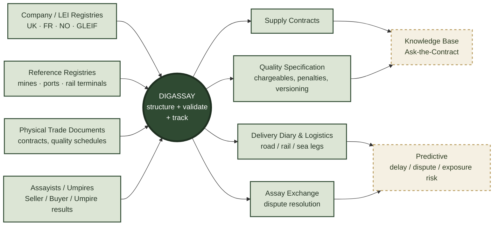

# DIGASSAY

**Digital infrastructure for physical commodity trading — contracts, quality, logistics and settlement, built for the way these deals actually happen.**

## Origin

DIGASSAY grows out of two decades of hands-on involvement in physical commodity trading operations — oil, coal, LNG and metal concentrates. That experience surfaced the same gap again and again: the tooling available to run a physical trade rarely matches how the trade is actually executed. Contracts live as scanned PDFs. Quality schedules with dozens of chargeable and penalty terms get re-typed into spreadsheets by hand. Assay disputes are resolved over email threads with no durable record. Logistics plans exist only in the heads of the people who booked the vessel.

DIGASSAY is an attempt to close that gap — starting from the real structure of a physical trade (a genuine, publicly-filed concentrate sale agreement was used to design the core data model) rather than from a generic "ERP for commodities" template.

## The Ecosystem

DIGASSAY sits at the centre, turning inputs from registries, reference data and the trade documents themselves into structured, queryable records — then, on the roadmap, turns that structured history into a knowledge base and a forecasting layer.

The four outputs around the hub — **Supply Contracts, Quality Specification, Delivery Diary & Logistics, Assay Exchange** — are live today: the physical trade lifecycle turned into structured, queryable data instead of documents and spreadsheets.

**Knowledge Base** (not yet built, dashed above) sits on top of that structured data and the underlying contract documents themselves, letting a trader or ops analyst ask a question in plain language and get an answer grounded in the actual contract text and terms — not a generic search.

**Predictive** (not yet built, dashed above) will use the growing body of real delivery and dispute history to anticipate problems before they happen: which deliveries are trending toward a late discharge, which counterparties or routes carry elevated dispute risk, where quality exposure is building up across an open book.

## Status

Everything under **Pre-Digital** is live and working end to end, built against real reference data (USGS mine registry, UN/LOCODE ports and rail terminals, GLEIF/company registries, a genuine SEC-filed concentrate sale agreement) rather than invented placeholders. It is a demonstration platform, not a production trading system — see the disclaimer on the live site.

A working demo is available at **[digassay.nrgpix.com](https://digassay.nrgpix.com)**.
