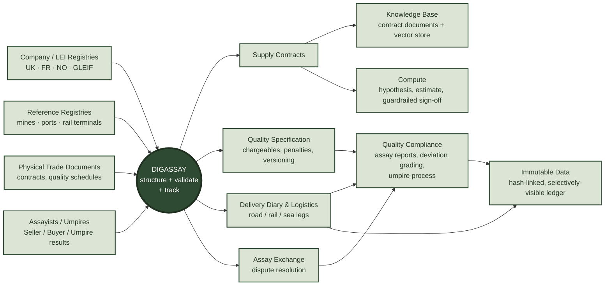

# DIGASSAY

**Digital infrastructure for physical commodity trading — contracts, quality, logistics and settlement, built for the way these deals actually happen.**

## Origin

DIGASSAY grows out of two decades of hands-on involvement in physical commodity trading operations — oil, coal, LNG and metal concentrates. That experience surfaced the same gap again and again: the tooling available to run a physical trade rarely matches how the trade is actually executed. Contracts live as scanned PDFs. Quality schedules with dozens of chargeable and penalty terms get re-typed into spreadsheets by hand. Assay disputes are resolved over email threads with no durable record. Logistics plans exist only in the heads of the people who booked the vessel.

DIGASSAY is an attempt to close that gap — starting from the real structure of a physical trade (a genuine, publicly-filed concentrate sale agreement was used to design the core data model) rather than from a generic "ERP for commodities" template.

## The Ecosystem

DIGASSAY sits at the centre, turning inputs from registries, reference data and the trade documents themselves into structured, queryable records — then turns that structured history into a quality-compliance and dispute-resolution layer, a tamper-evident shared record of it all, and a governed pipeline for running analysis over it.

The four outputs around the hub — **Supply Contracts, Quality Specification, Delivery Diary & Logistics, Assay Exchange** — are the physical trade lifecycle turned into structured, queryable data instead of documents and spreadsheets.

**Quality Compliance** compares every delivery's agreed Quality Specification against the assay reports that arrive for it — a private report commissioned at the point of extraction, a private one at the delivery point, one shared with the customer, as many or as few as arrive — grading each measured value against the agreed band and colour-coding the deviation. A one-click **umpire process** picks one of those reports at random as the disputed assay, simulates a binding determination against it, and emails the resulting profit-and-loss impact before the result ever reaches the screen.

**Immutable Data** is a real, hash-linked ledger of every one of those events, per contract — each new entry stamped with a fingerprint derived from its own contents and the entry before it, recomputed from scratch on every request rather than cached, so a single altered byte anywhere in the history is immediately and visibly detected. Not every record is visible to every party: a private assay report stays restricted to the parties entitled to read it, while its existence and timing are still provably part of the same chain everyone else can see.

**Knowledge Base** holds the contract documents themselves, uploaded to cloud storage and chunked into a private vector store for retrieval — DIGASSAY's own index, built entirely from its own data, not a third-party search API.

**Compute** is where analysis against that data actually runs: define a hypothesis, pick the data-dictionary columns it draws on, get a real dataset-size figure and a cost/time/accuracy appraisal per compute tier, and sign off — with a mandatory written justification above a $1,000/hour or 4-hour guardrail — before a job is allowed to submit.

## Dig deeper

**[DIGASSAY/digassay](https://github.com/DIGASSAY/digassay)** holds integration and domain-process documentation:

| Page | Covers |
| :--- | :--- |
| **[Freight & Cargo 1.00](https://github.com/DIGASSAY/digassay/blob/master/Integrations/Freight%20and%20Cargo/Freight%20and%20Cargo%201.00.md)** | Master page — how the vendor integrations fit together |
| [↳ 1.01 CargoWise](https://github.com/DIGASSAY/digassay/blob/master/Integrations/Freight%20and%20Cargo/Freight%20and%20Cargo%201.01%20CargoWise.md) | WiseTech Global — eAdaptor XML messaging |
| [↳ 1.02 Coneksion](https://github.com/DIGASSAY/digassay/blob/master/Integrations/Freight%20and%20Cargo/Freight%20and%20Cargo%201.02%20Coneksion.md) | Youredi — OAuth 2.0 REST API + webhooks |
| [↳ 1.03 OpenLink Endur](https://github.com/DIGASSAY/digassay/blob/master/Integrations/Freight%20and%20Cargo/Freight%20and%20Cargo%201.03%20Endur.md) | ION Group — JVS/OpenComponents, User Tables, DEX |
| **[Knowledge Base & Compute](https://github.com/DIGASSAY/digassay/blob/master/Knowledge%20Base/Historical%20Deliveries.md)** | How the two pages work today, and the deployment reasoning behind them (cloud/on-prem/hybrid, DIGASSAY's own LLM + private vector store) |
| **[Immutable Data — Overview](https://github.com/DIGASSAY/digassay/blob/master/Immutable%20Data/Overview.md)** | Why a tamper-evident shared history matters |
| [↳ Concept](https://github.com/DIGASSAY/digassay/blob/master/Immutable%20Data/Concept.md) | The model — hash-linked history, independent verifiability, selective visibility |
| [↳ Execution](https://github.com/DIGASSAY/digassay/blob/master/Immutable%20Data/Execution.md) | How it's actually built — the real schema, service and UI |
| **[Assay & Inspection Processes](https://github.com/DIGASSAY/digassay/tree/master/Assay%20and%20Inspection%20Processes)** | Master folder — real-world sampling, grading and dispute-resolution practice by commodity |
| [↳ Physical Coal](https://github.com/DIGASSAY/digassay/blob/master/Assay%20and%20Inspection%20Processes/Physical%20Coal.md) | SCoTA, ASTM/ISO — sampling, GAR/NAR/ash/sulfur, happy vs. disputed path |
| [↳ Physical Crude Oil](https://github.com/DIGASSAY/digassay/blob/master/Assay%20and%20Inspection%20Processes/Physical%20Crude%20Oil.md) | ASTM/EI — API gravity, sulfur, BS&W, happy vs. disputed path |
| [↳ LNG](https://github.com/DIGASSAY/digassay/blob/master/Assay%20and%20Inspection%20Processes/LNG.md) | GIIGNL CTMS — GHV, Wobbe Index, custody transfer measurement |
| [↳ Grains](https://github.com/DIGASSAY/digassay/blob/master/Assay%20and%20Inspection%20Processes/Grains.md) | GAFTA/FOSFA/USDA-FGIS — moisture, protein, falling number |
| [↳ Edible Oils](https://github.com/DIGASSAY/digassay/blob/master/Assay%20and%20Inspection%20Processes/Edible%20Oils.md) | FOSFA/PORAM/NIOP — FFA, peroxide value, contaminants |

## Status

The platform is live and working end to end, built against real reference data (USGS mine registry, UN/LOCODE ports and rail terminals, GLEIF/company registries, a genuine SEC-filed concentrate sale agreement) rather than invented placeholders. It is a demonstration platform, not a production trading system — see the disclaimer on the live site.

A working demo is available at **[digassay.nrgpix.com](https://digassay.nrgpix.com)**.
